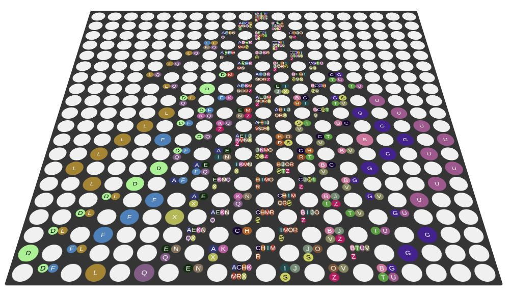

# Random walk simulation with api-stream
a basic demo to test [the random walk](https://en.wikipedia.org/wiki/Random_walk), sometimes known as a drunkard's walk.

## try it online
https://random-walk-sml.netlify.app/

# Stack
   *  Lit
   *  TypeScript
   *  Vite
   *  RxJs
   *  api-stream
# Envs Variables on .env file

URL_API_PROXY=http://your-project:9080

## How get the service working

please use these project https://github.com/pauloogsouza/stream-api

